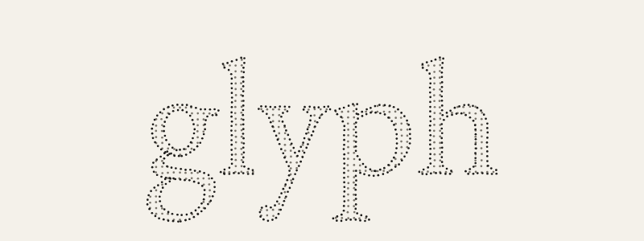
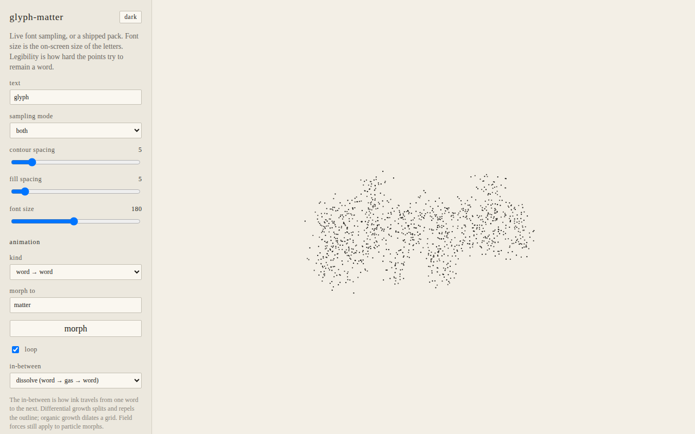
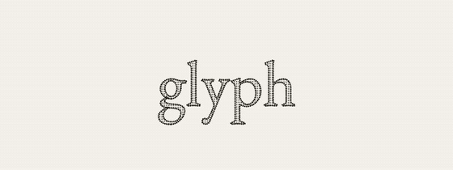
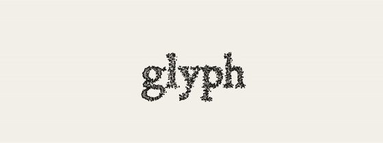
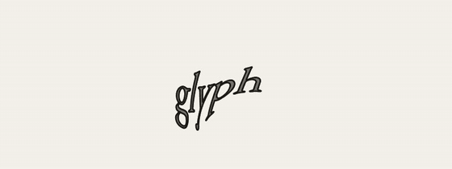
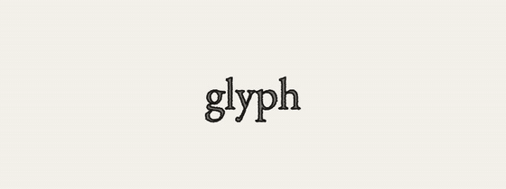

# glyph-matter

A browser library for electronic literature: sample a word from an OpenType
font into **matter** (points that still know which letter they are), then let
that matter rest as a word, loosen into gas, or become another word.



SVG and OpenType outlines are a source format, not the runtime. Path morphing
is one possible behavior. This engine refuses to treat it as the whole story.
The architecture sketch is in [docs/engine-sketch.md](docs/engine-sketch.md).

This is an early public library. Issues, patches, and experiments are welcome
— see [CONTRIBUTING.md](CONTRIBUTING.md).

## Contents

- [Install](#install)
- [Workbench](#workbench)
- [Quick start](#quick-start)
- [Examples](#examples)
- [Using with React](#using-with-react)
- [Using with Vue.js](#using-with-vuejs)
- [Documentation](#documentation)
- [Related work](#related-work)
- [Status](#status)
- [License](#license)

## Install

The package is not on npm yet. Use git, or clone the repo:

```bash
npm install github:miltonlaufer/glyph-matter
```

```bash
git clone https://github.com/miltonlaufer/glyph-matter.git
cd glyph-matter
npm install
```

Peer runtime: a bundler that can resolve TypeScript (Vite, or any tool that
understands `"exports"` pointing at `src/lib/index.ts`). The only runtime
dependency is [opentype.js](https://github.com/opentypejs/opentype.js).

```ts
import { GlyphMatter, World, drawParticles, makeView } from "glyph-matter";
```

From this repo, import the source directly:

```ts
import { GlyphMatter, World } from "./src/lib/index.ts";
```

## Workbench

```bash
npm run dev
```

Open `http://localhost:5173/` for the interactive workbench (font sampling,
word→word morph, dissolve, image contours, effects). On a narrow screen the
sidebar hides behind a hamburger at the top left.



| Script | What it does |
| --- | --- |
| `npm run dev` | Vite workbench + examples |
| `npm test` | Vitest |
| `npm run typecheck` | `tsc --noEmit` |
| `npm run lint` | ESLint |
| `npm run build` | Typecheck, then production build of the workbench |
| `npm run build:examples` | Static examples into `../glyph-matter-examples` |
| `npm run media` | README stills + GIFs (needs `npm run dev`, Chrome, ffmpeg) |
| `npm run media:video` | Example MP4s (skips webcam; muxes *Terminal Hours* onto the audio sketches) |

## Quick start

Sample a font, load the pack into a particle world, draw on a canvas:

```ts
import {
  GlyphMatter,
  World,
  drawParticles,
  makeView,
} from "glyph-matter";

const canvas = document.querySelector("canvas")!;
const ctx = canvas.getContext("2d")!;
const matter = new GlyphMatter({ samplingMode: "both", fontSize: 160 });
await matter.sampleFromFont("/fonts/YourFont.ttf", "glyph");

const pack = matter.getPack()!;
const world = new World().load(pack);

function frame(dt: number) {
  world.step(dt);
  const view = makeView(world.homeBounds(), canvas.width, canvas.height, {
    fit: "contain",
    dpr: window.devicePixelRatio,
    baseline: 0,
    em: pack.sampling.fontSize,
  });
  drawParticles(ctx, world.particles, view, {
    contourColor: "#1a1a1a",
    fillColor: "#6a6a6a",
  });
  requestAnimationFrame((now) => frame(now));
}
```

Ship a work **without** the font by exporting a pack once, then loading it:

```ts
const json = matter.exportSamplesJSON();
// later, in the published piece:
matter.loadSamples(json);
```

Word→word morph (shared letters keep their ink):

```ts
const next = matter.samplePack("matter");
world.morphTo(next, "origin");
```

Or a timed list — `Sequence` owns the in-between; you still own the render loop:

```ts
const show = new Sequence(gm, world)
  .addAnimationStep({ word: "glyph", duration: 1.2 })
  .addAnimationSteps([
    { word: "matter", duration: 1.2, effects: [{ kind: "wind", vx: 40, vy: 0, gust: 25 }] },
    { word: "glyph", x: 30, inBetween: "spring" },
  ])
  .play();

function frame(dt: number) {
  show.tick(dt); // advances the list, then world.step
  drawParticles(ctx, world.particles, view);
}
```

Forces can also be added directly, with no sequence:

```ts
world.addEffect({ kind: "attract", x: 0, y: 0, strength: 120, radius: 400 });
world.addEffect({ kind: "gravity", y: 300 });
world.step(dt);
```

## Examples

Live sketches — workbench and examples:
**[miltonlaufer.com.ar/glyph-matter-examples](https://www.miltonlaufer.com.ar/glyph-matter-examples)**.

Source for those pages is the workbench plus [`examples/`](examples/). After `npm run dev`:

| Example | Local | Live |
| --- | --- | --- |
| Workbench | http://localhost:5173/ | [workbench](https://www.miltonlaufer.com.ar/glyph-matter-examples/) |
| Field: a word as springy matter | http://localhost:5173/examples/field.html | [field](https://www.miltonlaufer.com.ar/glyph-matter-examples/field.html) |
| Word → word morph | http://localhost:5173/examples/morph.html | [morph](https://www.miltonlaufer.com.ar/glyph-matter-examples/morph.html) |
| Dissolve as the in-between | http://localhost:5173/examples/in-between.html | [in-between](https://www.miltonlaufer.com.ar/glyph-matter-examples/in-between.html) |
| Attract (point well) | http://localhost:5173/examples/attract.html | [attract](https://www.miltonlaufer.com.ar/glyph-matter-examples/attract.html) |
| Wind (traveling gust) | http://localhost:5173/examples/wind.html | [wind](https://www.miltonlaufer.com.ar/glyph-matter-examples/wind.html) |
| Vortex | http://localhost:5173/examples/vortex.html | [vortex](https://www.miltonlaufer.com.ar/glyph-matter-examples/vortex.html) |
| Sequence + wind / attract | http://localhost:5173/examples/sequence.html | [sequence](https://www.miltonlaufer.com.ar/glyph-matter-examples/sequence.html) |
| Image contours | http://localhost:5173/examples/image.html | [image](https://www.miltonlaufer.com.ar/glyph-matter-examples/image.html) |
| Webcam — one still per camera step + mic | http://localhost:5173/examples/webcam.html | [webcam](https://www.miltonlaufer.com.ar/glyph-matter-examples/webcam.html) |
| Audio wind | http://localhost:5173/examples/audio.html | [audio](https://www.miltonlaufer.com.ar/glyph-matter-examples/audio.html) |
| Audio bands (treble wind, bass vortex) | http://localhost:5173/examples/audio-bands.html | [audio-bands](https://www.miltonlaufer.com.ar/glyph-matter-examples/audio-bands.html) |

Publish a fresh copy of the live folder with `npm run build:examples` (writes `../glyph-matter-examples`). Hosted at [miltonlaufer.com.ar/glyph-matter-examples](https://www.miltonlaufer.com.ar/glyph-matter-examples).

**Field** — pointer push, click to scatter:


**Morph** — `glyph` ⇄ `matter`, shared letters keep their ink:


**Dissolve** — word → gas → word:



**Attract** — point well below the word (offset 0, 76 / strength 202 / radius 511):


**Wind** — traveling gust, positive half of a sawtooth (140, 0 / gust 50 / period 1.4 s / wavelength 677):



**Vortex** — swirl well below the word (offset 0, 160 / strength 577 / radius 289):



**Image** — Canny contours of a photo (`glyph` → sunset → `matter` → book). Extra points grow from existing ink; rest pose is slightly loose so the cloud stays alive.



**Webcam** — same loop as image (`glyph` → snapshot → `matter` → snapshot). Each time the sequence enters a camera step it grabs **one** new mirrored still and holds it (the camera stays on). The microphone drives wind (no lowpass, no speaker playback) with a level meter next to **stop**.

**Audio** — `glyph` → `matter` → `dancing`, with wind from *Terminal Hours*. Click to start (browser autoplay); **stop** at the bottom. Optional **lowpass** is analyser-only (the mix stays dry); a log slider sets the cutoff (80 Hz–8 kHz).

**Audio bands** — same track and words. Treble (2–8 kHz) drives wind; bass (20–280 Hz) drives a vortex below the word.

MP4 recordings of the sketches (except webcam, which needs a camera) live in [`docs/media/`](docs/media/). Audio examples include *Terminal Hours*. Regenerate with `npm run media:video` while the workbench is running.

## Using with React

The engine is canvas + `requestAnimationFrame`. Host that loop in `useEffect`
and tear it down on unmount. Put the `.ttf` in `public/fonts/` (Vite) so the
URL below resolves.

```tsx
import { useEffect, useRef } from "react";
import {
  GlyphMatter,
  World,
  drawParticles,
  makeView,
} from "glyph-matter";

export function GlyphField({ text = "glyph" }: { text?: string }) {
  const canvasRef = useRef<HTMLCanvasElement>(null);

  useEffect(() => {
    const canvas = canvasRef.current;
    const ctx = canvas?.getContext("2d");
    if (!canvas || !ctx) return;

    let raf = 0;
    let cancelled = false;
    const world = new World();

    const resize = () => {
      const dpr = Math.min(2, window.devicePixelRatio || 1);
      canvas.width = Math.round(canvas.clientWidth * dpr);
      canvas.height = Math.round(canvas.clientHeight * dpr);
      return dpr;
    };

    void (async () => {
      const matter = new GlyphMatter({ samplingMode: "both", fontSize: 160 });
      await matter.sampleFromFont("/fonts/YourFont.ttf", text);
      const pack = matter.getPack();
      if (cancelled || !pack) return;
      world.load(pack);

      const frame = () => {
        const dpr = resize();
        world.step(1 / 60);
        const view = makeView(world.homeBounds(), canvas.width, canvas.height, {
          fit: "contain",
          dpr,
          baseline: 0,
          em: pack.sampling.fontSize,
        });
        drawParticles(ctx, world.particles, view, {
          contourColor: "#1a1a1a",
          fillColor: "#6a6a6a",
        });
        raf = requestAnimationFrame(frame);
      };
      raf = requestAnimationFrame(frame);
    })();

    return () => {
      cancelled = true;
      cancelAnimationFrame(raf);
    };
  }, [text]);

  return (
    <canvas
      ref={canvasRef}
      style={{ display: "block", width: "100%", height: "100%" }}
    />
  );
}
```

Word→word is the same world: call `world.morphTo(matter.samplePack("matter"), "origin")` from a button handler, or drive a `Sequence` with `show.tick(dt)` inside the frame loop.

## Using with Vue.js

Same loop, mounted on the canvas ref. This is `<script setup>` for Vue 3.

```vue
<script setup lang="ts">
import { onMounted, onUnmounted, ref } from "vue";
import {
  GlyphMatter,
  World,
  drawParticles,
  makeView,
} from "glyph-matter";

const props = withDefaults(defineProps<{ text?: string }>(), { text: "glyph" });
const canvasRef = ref<HTMLCanvasElement | null>(null);
let raf = 0;
let cancelled = false;

onMounted(async () => {
  const canvas = canvasRef.value;
  const ctx = canvas?.getContext("2d");
  if (!canvas || !ctx) return;

  const resize = () => {
    const dpr = Math.min(2, window.devicePixelRatio || 1);
    canvas.width = Math.round(canvas.clientWidth * dpr);
    canvas.height = Math.round(canvas.clientHeight * dpr);
    return dpr;
  };

  const matter = new GlyphMatter({ samplingMode: "both", fontSize: 160 });
  await matter.sampleFromFont("/fonts/YourFont.ttf", props.text);
  const pack = matter.getPack();
  if (cancelled || !pack) return;
  const world = new World().load(pack);

  const frame = () => {
    const dpr = resize();
    world.step(1 / 60);
    const view = makeView(world.homeBounds(), canvas.width, canvas.height, {
      fit: "contain",
      dpr,
      baseline: 0,
      em: pack.sampling.fontSize,
    });
    drawParticles(ctx, world.particles, view, {
      contourColor: "#1a1a1a",
      fillColor: "#6a6a6a",
    });
    raf = requestAnimationFrame(frame);
  };
  raf = requestAnimationFrame(frame);
});

onUnmounted(() => {
  cancelled = true;
  cancelAnimationFrame(raf);
});
</script>

<template>
  <canvas ref="canvasRef" class="glyph-field" />
</template>

<style scoped>
.glyph-field {
  display: block;
  width: 100%;
  height: 100%;
}
</style>
```

## Documentation

- **[docs/api.md](docs/api.md)** — every public class, function, method, and type
- **[docs/engine-sketch.md](docs/engine-sketch.md)** — why matter, not SVG morph
- **[examples/](examples/)** — small programs you can run and copy
- Types and JSDoc live next to the code in `src/lib/`. The library is
  TypeScript-first; editors pick up types from `src/lib/index.ts`. JSDoc is
  there for hover text and for JavaScript callers — it is not a second API.

## Related work

There are strong libraries for **adjacent** slices. None of them is this
stack: OpenType sampling with glyph identity, a shippable point pack, letter-aware
word→word morph, and cellular automata / organic growth / differential growth
as ways ink travels between words.

| Library | What it does | Gap |
| --- | --- | --- |
| [glyphdust](https://github.com/linno-inc/glyphdust) | R3F: text → GPU particles → next glyph, often scroll-driven | Motion graphic; no glyph ids, no CA / growth, no shipped packs |
| [jl-particle-interactive](https://github.com/cjorgeluis122333/jl-particles-interactive), [canvas-text-particle](https://github.com/dango0812/canvas-text-particle), [masoneffect](https://github.com/fe-hyunsu/masoneffect) | Draw text, sample **pixels**, spring to homes, mouse scatter | Raster sampling; no linguistic morph, no identity |
| [tsparticles](https://github.com/tsparticles/tsparticles) | General particle engine | Text is a shape emitter, not a word with letters |
| [flubber](https://github.com/veltman/flubber), [GSAP MorphSVG](https://gsap.com/docs/v3/Plugins/MorphSVGPlugin/), [KUTE.js](https://github.com/thednp/kute.js) | Interpolate **SVG paths** | The behavior this engine treats as one plugin, not the runtime |
| [opentype.js](https://github.com/opentypejs/opentype.js) | Parse fonts, get glyph paths | A dependency here, not a particle engine |
| [p5.Font](https://p5js.org/reference/p5/p5.Font/), [Paper.js](https://github.com/paperjs/paper.js) | Rasterize or draw text | Drawing tools, not a morphing word field |
| [jasonwebb/2d-differential-growth-experiments](https://github.com/jasonwebb/2d-differential-growth-experiments), [adrianton3/differential-growth](https://github.com/adrianton3/differential-growth) | Differential growth on polylines / SVG | Growth experiments, not a word engine |

If you know a closer relative, please open an issue — that comparison belongs
in this list.

## Status

v0.1. Public API may still move. Sampling, packs, `World`, morph matching,
automata, growth, and differential growth are covered by tests. A published
npm tarball with emitted `.js` + `.d.ts` is not set up yet; until then, consume
the TypeScript source through a bundler.

## License

[MIT](LICENSE) © Milton Läufer
