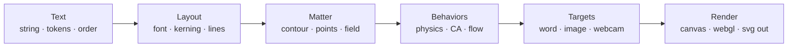

# Glyph matter — engine sketch

A browser library for a sequence of works in which words are readable, then become matter, then become other words, images, webcam fields, or physical systems — without throwing away language.

Continues lines already in the practice: *mutations*, *caligramas de Babel*, *constellation*, *text’s topology*, *palabras frágiles*, *Word is a Virus*, *The Void that Holds Words Together*, *through the looking-words*.

## Core bet

Treat SVG and OpenType outlines as a **source format**, not as the runtime. The live object is **matter** (contours, a point cloud, a density field) that still knows which letter, word, and reading position it came from. SVG path morphing is one behavior, not the engine.

| Knob | Meaning |
| --- | --- |
| identity | a particle remembers its glyph |
| legibility | continuous, not a boolean |
| three bodies | contour · points · field |
| plugins | behaviors and targets swap |

## Pipeline

Linguistic text stays alive all the way through. Matter is a view of it, not a replacement.

```text
Text        →  Layout       →  Matter              →  Behaviors         →  Targets              →  Render
string         font            contour · points       physics · CA        word · image           canvas
tokens         kerning         field                  flow · growth       webcam                 webgl
order          lines                                                       · physical systems     svg out
```



## Three interchangeable bodies

Naive particle-text demos pick one representation and get stuck. Word-to-word, word-to-image, and gases need different geometry. Convert between these three; do not bet the library on a single one.

| Body | What it is | Good for | Weak at |
| --- | --- | --- | --- |
| **Contour** | OpenType beziers, holes intact | crisp type, stroke drawing, SVG export | webcam, CA, melting |
| **Point cloud** | samples on outline and/or fill, with home pose | physics, flocking, word↔word transport | changing topology, solid silhouettes |
| **Field / SDF** | occupancy or signed distance grid | image fitting, metaballs, marching squares, CA | keeping a single letter’s identity |

## How morphing should actually work

Do not interpolate two SVG path strings and hope the point counts match. `o` has a hole; `l` does not; a face from a webcam is not a glyph. Use the method that matches the topology change you want.

### Word → word

Sample both strings into point clouds. Move mass with nearest-neighbor first, then optimal transport. Identity can be kept (this particle was always the `a`) or surrendered (any ink can become any ink).

Fallback: SDF blend + marching squares when letters should split, merge, or grow extra counters.

In-between processes (how ink travels while the rest pose retargets):

- **Particles (spring)** — home springs pull the cloud toward the new word
- **Dissolve** — word → gas → word
- **Cellular automata** — Life, Seeds, or Brian’s Brain on a pixel field seeded by the old word
- **Organic growth** — Eden dilation along a corridor from A into B
- **Differential growth** — outlines split long edges, locally repel, then settle onto B

### Word → image / webcam

**Now:** a photo or **one** webcam still is sampled into the same point pack a
word uses (`sampleImage` / `sampleImageFromRgba`: Canny edges, not a dark
rectangle). `World.morphTo` treats a one-glyph pack as one cloud; extra points
clone from existing ink. The webcam example grabs **one** still each time
the sequence enters a camera step (camera stays on; the hold does not keep
resampling). The mic drives `windFromAnalyser` with a level meter in the page.

**Sketch, not built:** luminance-field descent, SDF blend toward an image,
live webcam frames as a moving target, optical flow as a behavior.

## Behaviors as plugins

A behavior is `apply(matter, dt, world)`. Stack them with weights. The artistic knob is almost always the mix between a home spring (stay a letter) and a dissolving force.

| Plugin | Acts on | Literary use |
| --- | --- | --- |
| HomeSpring | points | reconstitution; the word remembers itself |
| TargetAttract | points / field | becoming another word or an image |
| Gas / Brownian | points | evaporation, heat, forgetting |
| Collision / Verlet | points | letters as bodies that bump and pile |
| Cellular automata | field | virus, decay, growth — *Word is a Virus* as geometry |
| Organic / differential growth | field / contour | morphogenesis; the letter as a growing body |
| Flocking | points | cohesion by word, by POS, by vowel |
| Flow field | points | wind, water, curl noise through a line |
| Metaball / implicit | points → field | ink pooling, melting, counters flooding |
| LegibilityForce | any | a constraint that fights dissolution; *the void that holds words together* |

## Do not drop the linguistic layer

Motion-graphics particle text is dead language: glyphs are only silhouettes. This sequence only stays electronic literature if behaviors can address words, letters, n-grams, vowels, verbs. Matter points back at the string.

- this word’s particles flock
- vowels evaporate first
- `e` is infectious (CA)
- trigrams keep local order
- translation: *palabra* → *word*
- `ñ` `ß` `ü` stay first-class

## Suggested first slice

Build the smallest loop that already contains the whole family of works. Everything after this is a plugin.

1. **Sample** — opentype.js → layout a string (kerning, marks) → contour and/or fill samples with home pose and glyph id.
2. **Mix** — HomeSpring + Gas + TargetAttract. One slider: **legibility**. Targets: another string, or an image luminance map.
3. **Draw** — Canvas 2D points and optional contour overlay. Webcam as one sampled still, not a live field. SVG only as font source and still export.

## Runtime, not ideology

SVG DOM for thousands of morphing path commands will not hold webcam + CA + collisions. Parse outlines once. Simulate on typed arrays. Draw on canvas or WebGL. Export SVG when a still or a plotter pass is the work.

Budget: 5–20k particles on Canvas 2D; 50k+ on WebGL points; 256–512 fields on CPU; webcam 1024 and CA on a GPU grid if needed later.

**Leave out of v0**

- Three.js / full 3D
- Matter.js as the world (no glyph identity)
- GSAP MorphSVG as the morpher
- p5 as the architecture (fine as a sketch host)

Those tools are neighbors. The library is the identity + field + behavior loop.

## In the current workbench

The loop above is running in `glyph-matter`:

| Sketch piece | Code |
| --- | --- |
| Sample (live font, image, or shipped pack) | `GlyphMatter`, `sample.ts`, `image.ts`, `pack.ts` |
| Point body + identity (`g`, home pose) | `SamplePoint`, `Particle` |
| HomeSpring + gas + pointer | `World` (`legibility`, `gas`) |
| Word → word pairing; extras bud from live ink | `morph.ts` |
| Field body (pixel grid) | `automata.ts` |
| Contour body (growing outlines) | `differential.ts` |
| Draw | `draw.ts` (canvas 2D) |

Built as image contours (`sampleImage`, Canny + texture stipple), webcam
stills (`sampleImageFromRgba` on one `<video>` frame per camera step), and
audio / mic wind (`windFromAnalyser`). Not built yet: flocking, flow fields,
metaballs, WebGL.
